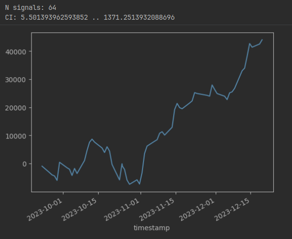
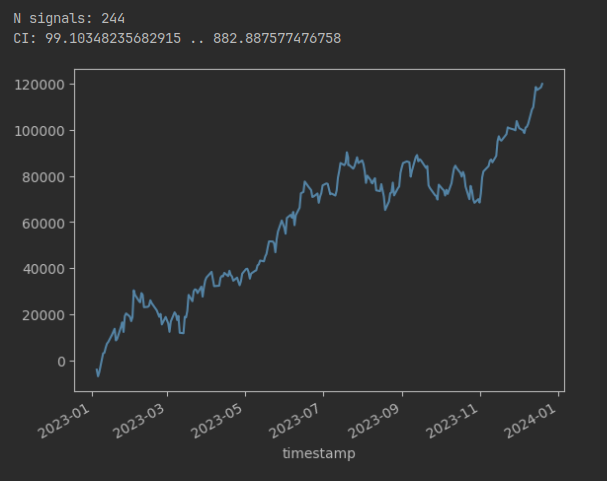

# Iterative Training of Open and Close Models

## Idea

On each iteration we train 4 models:

+ opening long

+ opening short

+ closing long

+ closing short

Each model accepts a bar (some feature vector) and returns a scalar that is interpreted as **utility**
of non-trivial action.

Non-trivial action of openinig models is opening.

Non-trivial action of closing models is doing nothing.

Utility of the trivial action is 0.

Utility formula:

```rust
let price_return: f64 = current_bar.mid_price.0 - start_bar.mid_price.0;
let sign: f64 = match self.trained_model_type.side {
   ModelSide::Long => 1.0,
   ModelSide::Short => -1.0,
};
let fee: f64 = match self.trained_model_type.action {
   ModelAction::Opening => self.fee * 2.0,
   ModelAction::Closing => 0.0,
};
let utility: f64 = ((price_return * sign) * self.multiplier - fee) * 10_000.0 
    / (start_bar.mid_price.0 * self.multiplier)
   - self.utility_penalty_bps;
```

For the openining models, `utility = price_return - 2 * fee`

For the closing models, `utility = price_return`

Each iteration includes 2 stages: collecting training set and training.

To collect a training, we run **plays**.

To run a play, we randomly select a bar and from that bar do inference with the closing model 
from the previous iteration. If the closing model returns a positive utility, we move to the next bar,
otherwise we consider the play finished: closing now is better than closing later.

After all plays in a batch are finished, we calculate the utility from each play. Price return is calculated
from between the start and end bars of the play.

Training sample is the combination of the starting bar of the play and the utility from that play.

Then we train all the models.

Then we start the next iteration.

This schema assumes that opening models depend on the closing models, but the closing model
do not depend on the opening models. 

The opening models tell if we can gain more than 2 fees by opening now given the current bar and
the closing models.

The closing models tell if closing later is expected to be better than closing now. 
To do so, they do not need to know current floating PnL.

Feature space (shape and semantics of the bars) is domain-specific.

Training and inference is done within the CPython runtime. 
Rust executable is linked against a shared library that initiates CPython and passes calls to it.

Modification in python code can be done without recompiling the rust code.

## Using Trained Models

Opening decision:

1. Get utility from the opening long model.

2. Get utility from the opening short model.

3. Act as follows:
   
   + If none of the utilities is positive, do nothing.

   + If only one of the utilities is positive, open long or short accordingly.

   + If both utilities are positive open long or short with probabilities proportional to the sum of utilities.

Closing decision:

1. Get utility from the closing long or closing short model, depending on position.

2. If this utility is positive, do nothing, otherwise close now.


## Building

```bash
make build
```

This will compile the shared library that embeds CPython.


## Running

```bash
target/release/main -h

Prototype of counterfactual regret minimization for trading

Usage: main [OPTIONS]

Options:
  -p, --print-config          Print config
  -c, --config <CONFIG_PATH>  Config path [default: io/config.toml]
  -h, --help                  Print help
```


## Example 

Dataset: 3-feature points (features 1, 2 and 4 as referred to in index stratagies):
NQ mid-price vs inferred NQ mid-price by referent equities.

Interval: 2023 (3/4 training set, 1/4 test set)

Model: linear regression

Config:

```toml
dataset_path = "io/dataset.bin"
start_iteration = 1
n_iterations = 15

[iteration]
n_plays = 4_000_000
concurrency = 10
output_dir = "io/models"
fee_per_contract_usd = 1.65 # NQ
multiplier = 20.0 # NQ
utility_penalty_bps = 0.05 # profit decrease due to execution not by mid-price
max_play_duration_in_bars  = 900
offset = 0.25
limit = 0.75

[backtest]
iteration = 14
models_dir = "io/bt_models"
profits_output_file = "io/profits.csv"
offset = 0.75
limit = 0.25
```

Results:

```
`+-----------+------------------+-------------------------+
| Iteration | Mean Play Length | Mean Utility Prediction |
+-----------+------------------+-------------------------+
|     1     |       2.21       |          0.0003         |
|     2     |       5.82       |          0.0129         |
|     3     |      48.07       |          0.1671         |
|     4     |      138.77      |          1.0223         |
|     5     |      64.97       |          1.2785         |
|     6     |       95.8       |          0.3556         |
|     7     |      187.7       |          2.5258         |
|     8     |      325.18      |          1.5751         |
|     9     |      435.02      |          4.5992         |
|     10    |      457.1       |          6.9023         |
|     11    |      450.05      |          6.5183         |
|     12    |      454.97      |          6.7978         |
|     13    |      451.56      |          6.553          |
|     14    |      455.93      |          6.9046         |
|     15    |      453.4       |          6.4919         |
+-----------+------------------+-------------------------+``
```

Predicted utility is averaged here over all decision points of the play.

In a play only the last prediction of utility is negative (termination condition). 
This is why the mean prediction increases with the play length.


Backtest:

Test set



Full set




Params:

```
opening_long: {"coef": [0.17300462358807628, 0.033622359526197076, -0.05255397491951599], "intercept": 6.293762583369376, "loss": null}
closing_long: {"coef": [0.1525811802897294, 0.04453460176442493, -0.05721550936327624], "intercept": 6.829456054559397, "loss": null}
opening_short: {"coef": [-0.0006210175343476525, 0.0038367541961747864, 0.00028759150502061237], "intercept": -0.18653472237544577, "loss": null}
closing_short: {"coef": [0.00025350892837230015, 0.0016283998166727299, -0.00016871434613208018], "intercept": -0.07107046826251026, "loss": null
```

## Critics

What is learned is a long-only strategy. Nasdaq rose in 2023, so averaging the whole year gave
the short closing model that closes early. Hence, the short opening model learns not to open at all.

Profit only as utitily may seem a bad choice. 

What can be done:

+ Trying to balance the training set: select equal number of falling and rising days.

+ Online learning: train on some interval prior to the current day and use the resulting models 
  to trade the current day.


## Comparison with other Approaches

This approach is somewhat similar to gradient learning with backtest runs to determine the gradient.

1. A fully-connected neural network is randomly initialized with weights close to zero.

2. For each bar, this NN gives a score -1 to 1 to determine the action 
   (continuous size or unit size with a threshold).

3. Given a vector of scores for all bars, the profit is calculated. Some transformation of this profit
   is used as the value used to calculate the gradient (call it utility).

4. Weights are shifted by small value and steps 2 and 3 are repeated.

5. The gradient is calculated as the difference between the utilities of the original and shifted weights.

6. The weights are shifted in the direction of the gradient.

7. Steps 2-6 are repeated until some stop condition is met.


What is similar: 

+ Each weight shifting is a training iteration that gives a model used to do inference 
  on the next iteration.

+ The model is used to make decision on each bar.

What is different: 

+ No split to opening and closing models. 

+ Each inference gives one utility for the entire dataset. Maybe this is better, since utility
  can include standard deviation and number of trades, e.g. mean/standard error.


## Other Considerations

+ Probably there is no need to randomly select a bar during training. We can just go through all bars.

+ Fully-connected neural networks will probably do a better job than linear regression.

+ Feature set can be much reacher.

+ Discretization can be smaller.

+ During online learning, abrupt change in learning statistics can be used to skip some days.
  Rationale: if a market behavior changes, than it may be better not to average old and new behavior.

+ Training statistics can be used somehow tune models or select traning sets.